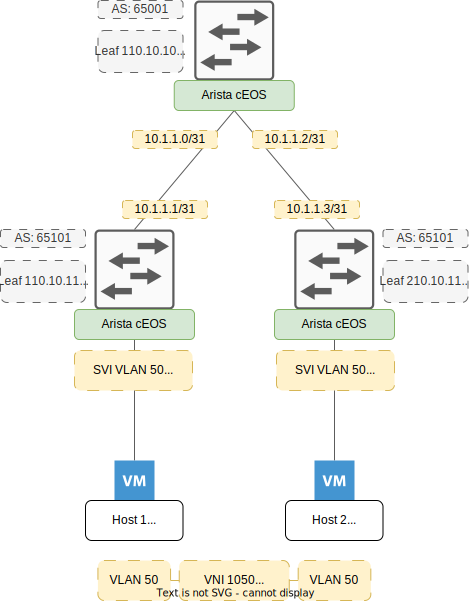

# VXLAN-EVPN Lab with ContainerLab

## Sources

- [ContainerLab](https://containerlab.dev)
- [Virtual Data Center Network](https://medium.com/@aifakhri/bgp-evpn-and-vxlan-configuration-with-arista-veos-b1046c24d046)

## Overview

This project provides a hands-on lab environment for understanding and experimenting with VXLAN-EVPN (Ethernet VPN) technology. Using ContainerLab, the lab sets up a VXLAN topology featuring 1 spine and 2 leaves nodes. The lab can be deployed directly on a PC with ContainerLab installed or through a DevContainer environment.

Here is a schema of the topology:



## Project Structure

The project directory is structured as follows:

- `hosts`: Directory containing host configuration files for the lab.
- `network_images/ceos-lab-4.32.0.1F.tar.xz`: Container image used for the lab nodes.
- `lab_vxlan.yml`: YAML file describing the VXLAN lab topology.

## Prerequisites

- Docker and Docker Compose (for DevContainer setup).
- ContainerLab installed either on the host or within the DevContainer.
- Basic understanding of networking and VXLAN-EVPN concepts.

## Setup and Deployment

1. **DevContainer Setup (Optional):**  
   If using DevContainer, ensure Docker and Docker Compose are installed on your machine.  
   Open the project in a compatible IDE (like Visual Studio Code) and start the DevContainer environment.

2. **ContainerLab Setup:**
   - Direct Installation: Install ContainerLab on your host machine. Follow the [official installation guide](https://containerlab.dev/install/).
   - Via Terraform: Documentation available [here](https://github.com/MasqAs/AWS-ContainerLab-Deployment).

3. **Start the Lab:**
    1. Navigate to the project directory.
    2. Add the Arista image to Docker:

        ```bash
        docker import network_images/cEOS64-lab-4.32.0.1F.tar.xz ceos:4.32.0.1F
        ```

    3. Deploy the lab topology:

        ```bash
        sudo containerlab deploy -t lab_vxlan.yml
        ```

## Usage

- Once the lab is deployed, you can access the individual nodes (spines and leaves) via CLI or SSH to configure and test VXLAN-EVPN functionalities.  
- Use the `hosts` directory to modify or apply specific configurations for end user hosts
- To list the nodes deployed via the `lab_vxlan.yml`:

   ```bash
   containerlab inspect --name vxlan-evpn-irb
   ````

- Example command to configure a VXLAN interface:

    ```bash
    show bgp summary
    ```

    The configurations to apply on each node are listed [here](documentation/eos_configuration).

## Known Issues

To install the VLAN package on Alpine Linux hosts 1 and 2, follow these steps:

```bash
apk add vlan
```
